# Hi there! 👋

  

    
  

  

    <h2 style="margin: 0 0 15px 0;">Audio Deepfake Detection</h2>
    
A project to identify synthetic or manipulated audio using machine learning techniques. It leverages Python, TensorFlow, and Librosa for feature extraction, model training, and real-time detection. Designed for accuracy, scalability, and easy integration into existing systems.

  

